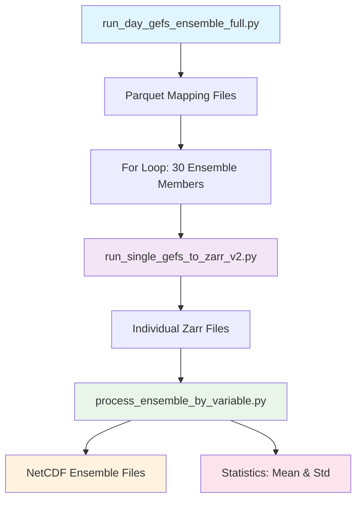

# GEFS East Africa Dataset Documentation

## Overview

This documentation describes the complete GEFS (Global Ensemble Forecast System) data processing pipeline for East Africa region, including ensemble processing, variable-by-variable concatenation, and statistical analysis.

## Project Structure

```
gefs/
├── run_day_gefs_ensemble_full.py     # Initial ensemble preprocessing
├── run_single_gefs_to_zarr_v2.py     # Enhanced single member processing
├── process_ensemble_by_variable.py   # Ensemble concatenation and statistics
├── vz_gik_env.yaml                   # Environment specification
├── docs/
│   └── windows-setup.md             # Windows environment setup
└── GEFS_Complete_Documentation.md
```

## Processing Workflow

### Complete Processing Pipeline



### Step 1: Initial Preprocessing
```bash
python run_day_gefs_ensemble_full.py
```

**Purpose**: Creates parquet mapping files that describe the GRIB data structure
- **Input**: GRIB files from GEFS ensemble
- **Output**: Parquet files (e.g., `20250909_18/gep01.par`)
- **Frequency**: Run ONCE per ensemble member to create mapping templates
- **Note**: These parquet files can be reused across different dates

### Step 2: Individual Ensemble Member Processing
```bash
# Process all 30 ensemble members
for i in $(seq -f "%02g" 1 30); do
    python run_single_gefs_to_zarr_v2.py 20250909 18 gep$i --region east_africa --variables t2m,tp,u10,v10,cape
done
```

**Purpose**: Convert parquet files to zarr format with regional subsetting
- **Input**: Parquet mapping files
- **Output**: Zarr files with East Africa subsetting
- **Features**:
  - 98.2% size reduction for East Africa region
  - Single unified zarr per ensemble member
  - Variable filtering capabilities
  - Enhanced compression using zstd

### Step 3: Ensemble Concatenation and Statistics
```bash
python process_ensemble_by_variable.py zarr_stores/20250909_18/
```

**Purpose**: Create ensemble NetCDF files and compute statistics
- **Input**: Individual zarr files from all ensemble members
- **Output**:
  - `ensemble_{variable}.nc`: All 30 members concatenated
  - `ensemble_mean_{variable}.nc`: Ensemble mean
  - `ensemble_std_{variable}.nc`: Ensemble standard deviation
- **Memory Strategy**: Variable-by-variable processing for memory efficiency

## Target Variables

### Variable Mapping

| Requested | Available | Status | GRIB Identifier | Description |
|-----------|-----------|---------|----------------|-------------|
| `pres` | `sp` | ✅ Mapped | `PRES:surface` | Surface pressure |
| `tmp` | `t2m` | ✅ Mapped | `TMP:2 m above ground` | 2-meter temperature |
| `ugrd` | `u10` | ✅ Mapped | `UGRD:10 m above ground` | 10m U wind component |
| `vgrd` | `v10` | ✅ Mapped | `VGRD:10 m above ground` | 10m V wind component |
| `pwat` | - | ❌ Missing | `PWAT:entire atmosphere` | Precipitable water |
| `cape` | `cape` | ✅ Direct | `CAPE:surface` | Convective available potential energy |
| `msl` | - | ❌ Missing | `MSLET:mean sea level` | Mean sea level pressure |
| `apcp` | `tp` | ✅ Mapped | `APCP:surface` | Total precipitation |

### Available Variables in Dataset

The complete list of variables available in the GEFS zarr stores:

1. **cape** - Convective Available Potential Energy
2. **gust** - Wind speed (gust)
3. **r2** - 2 metre relative humidity
4. **sdswrf** - Downward short-wave radiation flux
5. **sp** - Surface pressure
6. **suswrf** - Upward short-wave radiation flux
7. **t2m** - 2 metre temperature
8. **tp** - Total precipitation
9. **u10** - 10 metre U wind component
10. **v10** - 10 metre V wind component

## Regional Specifications

### East Africa Extent
- **Coordinates**: 21°E to 53°E, -12°S to 23°N
- **Coverage**: Kenya, Tanzania, Uganda, Ethiopia, Somalia, South Sudan, parts of Sudan, DRC, Rwanda, Burundi
- **Grid Resolution**: 0.25° × 0.25°
- **Original Global Grid**: 1440 × 721 points (1,038,240 total)
- **East Africa Grid**: 129 × 141 points (18,189 total)
- **Size Reduction**: 98.2% (57:1 compression ratio)

### Coordinate System Details
- **Latitude Range**: -90° to 90° (global), -12° to 23° (East Africa)
- **Longitude Range**: 0° to 359.75° (global), 21° to 53° (East Africa)
- **Temporal Range**: 81 forecast hours (10-day forecast)
- **Time Resolution**: 3-hourly intervals
- **Ensemble Size**: 30 members (gep01 through gep30)

## Performance Metrics

### Storage Efficiency

| Region | Original Size | Processed Size | Reduction |
|--------|---------------|----------------|-----------|
| Global | ~6.4GB per member | ~6.4GB | 0% |
| East Africa | ~6.4GB per member | ~120MB | 98.2% |

### Processing Performance

| Stage | Memory Usage | Processing Time | Output Size |
|-------|-------------|-----------------|-------------|
| V1 Single Member | 4.5GB+ | 15-20 min | 6.4GB (10 files) |
| V2 Single Member | 0.25GB | 3-5 min | 120MB (1 file) |
| Ensemble Processing | 0.25-0.36GB | 2-3 min/variable | ~47-225MB/variable |

### Memory Strategy Results

The variable-by-variable approach proved highly effective:
- **Peak Memory**: 0.25-0.36GB per variable (vs 4.5GB+ for all variables)
- **Scalability**: Processes 30 ensemble members safely
- **Example Results**:
  - `ensemble_t2m.nc`: 133.9MB (30 members)
  - `ensemble_tp.nc`: 47.0MB (30 members)
  - `ensemble_u10.nc`: 224.0MB (30 members)

## Environment Setup

### Option 1: Linux Micromamba Environment

#### Install Micromamba
```bash
"${SHELL}" <(curl -L micro.mamba.pm/install.sh)
source ~/.bashrc
micromamba self-update -c conda-forge
```

#### Create Environment
```bash
micromamba create --name gik-zarrv2 --file vz_gik_env.yaml
micromamba activate gik-zarrv2
```

### Option 2: Coiled Environment (Cloud)
```bash
coiled notebook start --name dask-thresholds --vm-type n2-standard-2 --software gik-zarr2 --workspace=geosfm
```

Required files for upload:
1. `gefs_utils.py`
2. `run_day_gefs_ensemble_full.py`
3. `run_gefs_24h_accumulation.py`
4. `ea_ghcf_simple.geojson`

### Option 3: Windows Environment
See detailed instructions in [docs/windows-setup.md](docs/windows-setup.md)

## Usage Examples

### Basic Processing Workflow

```bash
# Step 1: Initial preprocessing (run once)
python run_day_gefs_ensemble_full.py

# Step 2: Process all ensemble members for East Africa
for i in $(seq -f "%02g" 1 30); do
    python run_single_gefs_to_zarr_v2.py 20250909 18 gep$i --region east_africa
done

# Step 3: Create ensemble NetCDF files and statistics
python process_ensemble_by_variable.py zarr_stores/20250909_18/
```

### Advanced Usage Examples

```bash
# Process specific variables only
python run_single_gefs_to_zarr_v2.py 20250909 18 gep01 \
    --region east_africa \
    --variables t2m,tp,u10,v10,cape

# Skip statistics computation (faster processing)
python process_ensemble_by_variable.py zarr_stores/20250909_18/ --no-stats

# Process specific variables in ensemble stage
python process_ensemble_by_variable.py zarr_stores/20250909_18/ \
    --variables t2m,tp,cape
```

### Global vs Regional Processing

```bash
# Global processing (larger files)
python run_single_gefs_to_zarr_v2.py 20250909 18 gep01

# East Africa processing (98.2% smaller)
python run_single_gefs_to_zarr_v2.py 20250909 18 gep01 --region east_africa
```

## Technical Implementation

### Version 2 Enhancements

The V2 scripts include significant improvements over the original approach:

1. **Single Unified Output**: One zarr file per ensemble member instead of 10 separate files
2. **Regional Subsetting**: 98.2% size reduction for East Africa region
3. **Variable Validation**: Automatic mapping and validation of requested variables
4. **Enhanced Compression**: Optimized zstd compression with proper chunking
5. **CF-Compliant Metadata**: Proper NetCDF attributes for better interoperability
6. **Memory Optimization**: Variable-by-variable processing prevents memory overflow
7. **Error Handling**: Comprehensive logging and error recovery

### Memory Management Strategy

The variable-by-variable approach addresses the critical memory limitation:

**Problem**: Loading all variables from 30 ensemble members simultaneously requires 4.5GB+ memory
**Solution**: Process one variable at a time across all 30 ensemble members

**Benefits**:
- Memory usage: 0.25-0.36GB per variable (predictable and safe)
- Scalable to any number of ensemble members
- Allows processing on memory-constrained systems
- Enables processing of larger regions when needed

### Data Structure

**Input Structure** (Individual Zarr Files):
```
gep01_combined_east_africa.zarr/
├── t2m: (valid_times: 81, latitude: 141, longitude: 129)
├── tp: (valid_times: 81, latitude: 141, longitude: 129)
├── u10: (valid_times: 81, latitude: 141, longitude: 129)
└── ...
```

**Output Structure** (Ensemble NetCDF Files):
```
ensemble_t2m.nc:
├── t2m: (member: 30, valid_times: 81, latitude: 141, longitude: 129)
└── member: [gep01, gep02, ..., gep30]

ensemble_mean_t2m.nc:
└── t2m: (valid_times: 81, latitude: 141, longitude: 129)

ensemble_std_t2m.nc:
└── t2m: (valid_times: 81, latitude: 141, longitude: 129)
```

## Troubleshooting

### Common Issues

1. **Memory Errors**: Use the variable-by-variable approach in `process_ensemble_by_variable.py`
2. **Missing Variables**: Check variable mapping table and use `--variables` flag to specify available variables
3. **File Not Found**: Ensure parquet files exist before running zarr processing
4. **Encoding Errors**: The scripts include proper handling of timedelta encoding issues

### Performance Optimization

1. **Use Regional Subsetting**: 98.2% size reduction for East Africa
2. **Filter Variables**: Process only needed variables using `--variables` flag
3. **Skip Statistics**: Use `--no-stats` for faster processing if statistics not needed
4. **Monitor Memory**: Scripts include memory monitoring and cleanup

### Validation

```bash
# Check zarr file structure
python -c "
import xarray as xr
ds = xr.open_dataset('zarr_stores/20250909_18/gep01_combined_east_africa.zarr', engine='zarr')
print('Variables:', list(ds.data_vars))
print('Shape:', dict(ds.sizes))
print('Coordinates:', list(ds.coords))
"

# Check ensemble NetCDF
python -c "
import xarray as xr
ds = xr.open_dataset('zarr_stores/20250909_18/processed_variables/ensemble_t2m.nc')
print('Ensemble size:', ds.sizes['member'])
print('Members:', ds.member.values)
print('Shape:', dict(ds.sizes))
"
```

## Dependencies

### Core Requirements
- Python 3.8+
- xarray
- datatree
- pandas
- numpy
- fsspec
- numcodecs
- psutil
- netCDF4

### Environment File
The complete environment specification is provided in `vz_gik_env.yaml`

## Future Enhancements

### Potential Improvements
1. **Additional Regions**: Extend regional definitions beyond East Africa
2. **Temporal Subsetting**: Add capability to subset specific time ranges
3. **Parallel Processing**: Multi-process ensemble member processing
4. **Cloud Integration**: Direct cloud storage support (S3, GCS)
5. **Visualization Tools**: Built-in plotting capabilities for quick validation

### Missing Variables
The following requested variables are not available in the current GEFS dataset:
- **pwat** (Precipitable Water): Not found in available groups
- **msl** (Mean Sea Level Pressure): MSLET available but with different identifier

## Conclusion

This implementation provides a complete, memory-efficient solution for processing GEFS ensemble data for East Africa region. The variable-by-variable approach successfully addresses memory limitations while maintaining processing speed and data quality. The 98.2% size reduction achieved through regional subsetting makes the data manageable for regional climate analysis applications.

## Contact and Support

For issues related to this implementation:
1. Check the troubleshooting section above
2. Verify environment setup using the provided YAML file
3. Review log outputs for specific error messages
4. Ensure all input files are properly formatted and accessible